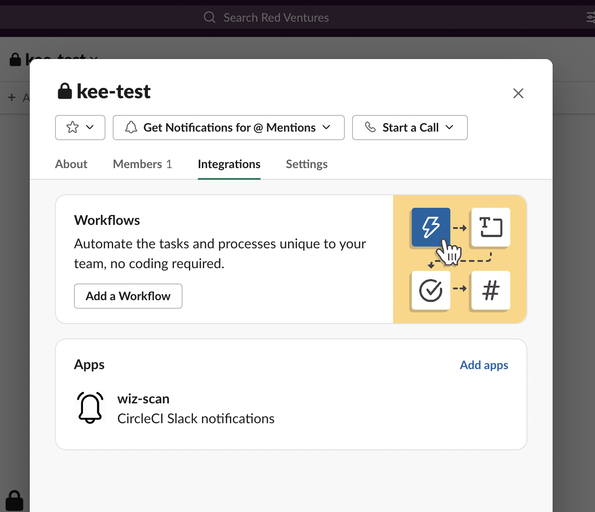

# wiz-orb

This action scans for Docker image vulnerabilities using Wiz and sends Slack notifications when it finds high/critical vulnerabilities. The orb has two commands:
  
  - `wiz/scan`: Scans the Docker image and uploads results as an artifact
  
  - `wiz/scan-and-notify`: Scans the Docker image and sends a Slack message on failure for high/critical vulnerabilities
  
### Pre-requisites
* To utilize Wiz CLI ID & secret and Slack access token, you can use the `wiz` context for RedVentures, lonelyplanet and CreditCardsCom organizations.

### Usage
  https://circleci.com/developer/orbs/orb/redventures/wiz
  
>Note: To send Slack notifications to a private channel, you will need to add the `wiz-scan` app to the private channel (under Slack channel integration settings).
  

---

## Resources

[CircleCI Orb Registry Page](https://circleci.com/orbs/registry/orb/redventures/wiz) - The official registry page of this orb for all versions, executors, commands, and jobs described.

[CircleCI Orb Docs](https://circleci.com/docs/2.0/orb-intro/#section=configuration) - Docs for using, creating, and publishing CircleCI Orbs.

### How to Contribute

We welcome [issues](https://github.com/RedVentures/wiz-orb/issues) to and [pull requests](https://github.com/RedVentures/wiz-orb/pulls) against this repository!

This repository is designed to be automatically ingested and modified by the CircleCI CLI's `orb init` command.

### How to Publish An Update
1. Merge pull requests with desired changes to the main branch.
    - For the best experience, squash-and-merge and use [Conventional Commit Messages](https://conventionalcommits.org/).
2. Find the current version of the orb.
    - You can run `circleci orb info redventures/wiz | grep "Latest"` to see the current version.
3. Create a [new Release](https://github.com/RedVentures/wiz-orb/releases/new) on GitHub.
    - Click "Choose a tag" and _create_ a new [semantically versioned](http://semver.org/) tag. (ex: v1.0.0)
      - We will have an opportunity to change this before we publish if needed after the next step.
4.  Click _"+ Auto-generate release notes"_.
    - This will create a summary of all of the merged pull requests since the previous release.
    - If you have used _[Conventional Commit Messages](https://conventionalcommits.org/)_ it will be easy to determine what types of changes were made, allowing you to ensure the correct version tag is being published.
5. Now ensure the version tag selected is semantically accurate based on the changes included.
6. Click _"Publish Release"_.
    - This will push a new tag and trigger your publishing pipeline on CircleCI.
